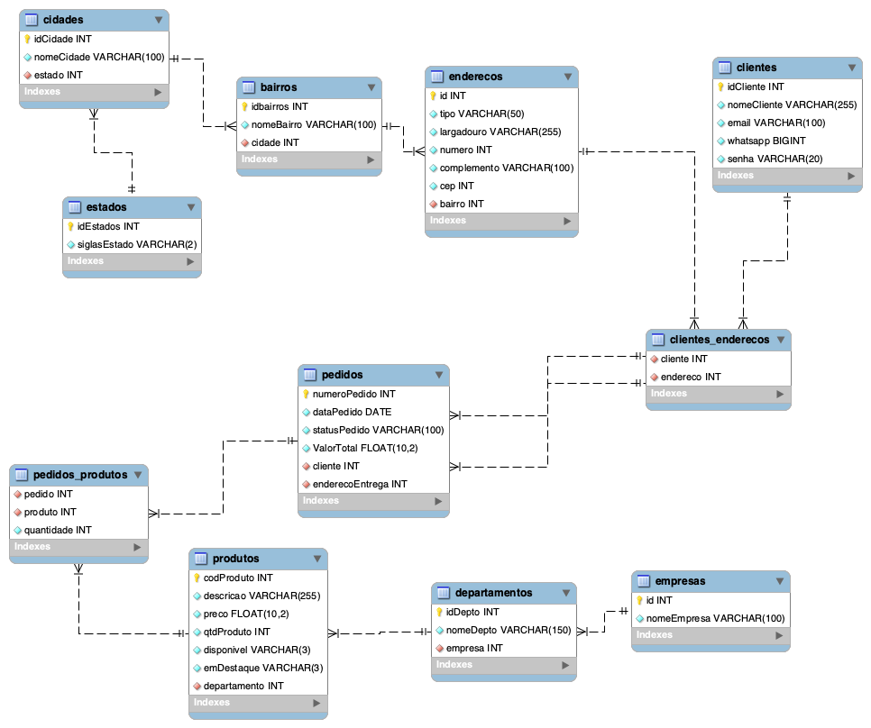

# Atividade 3 - Banco de dados

#### How to Use!

  * clone esse repositório.

Passos:
</br>

  1. importar as tabelas ao mysql, usando o arquivo (criacaotabelas.sql)
  2. importar todas as inserções das tabelas, usando o arquivo (insercoes.sql)
  3. realizar as consultas, todas estão em um único arquivo (consultas.sql)
---
  ## Modelo
  
---
  ## Consultas:

  #### no terminal para dar tudo certo, necessário fazer o seguinte antes de inserir as consultas: 
  > USE `gama`;

  >SET lc_time_names = "pt_br" ;

  <br>

  #### OBS: Todas as consultas são compostas por 1 situação problema, a consulta e o resultado emitido pelo terminal.

  <br>

* 1 consulta contemplando contagem ou totalização
  <br>
    
    **situação-problema**: Quero poder saber a quantidade total de produtos em estoque.
    <br>
    
    Código da consulta: 
    > SELECT SUM(qtdProduto) AS "Quantidade de produtos em estoque" FROM produtos;
  
    Retorno:

    ```console
    +-----------------------------------+
    | Quantidade de produtos em estoque |
    +-----------------------------------+
    |                              2568 |
    +-----------------------------------+
    1 row in set (0,20 sec)
    `````
* 1 consulta contemplando a junção entre 2 tabelas
  <br>
  
  **situação-problema**: Quero poder saber quais são meus clientes cadastrados e listar além de email e whatsapp todos os seus respectivos endereços (somente CEP).
  <br>
  Código da consulta: 
  > SELECT c.idCliente AS ID, c.nomeCliente AS "NOME CLIENTE", c.email AS "E-MAIL", CONCAT(SUBSTRING(c.whatsapp,1,2),' ',SUBSTRING(c.whatsapp,4,4),'-',SUBSTRING(c.whatsapp,8,4)) AS WHATSAPP, CONCAT(SUBSTRING(e.cep,1,2),'.',SUBSTRING(e.cep,3,3),'-',SUBSTRING(e.cep,6,3)) AS CEP FROM clientes_enderecos AS ce INNER JOIN clientes AS c ON c.idCliente = ce.cliente INNER JOIN  enderecos AS e ON e.id = ce.endereco;

  Retorno: 
  ```console
  +----+--------------------+---------------------+--------------+------------+
  | ID | NOME CLIENTE       | E-MAIL              | WHATSAPP     | CEP        |
  +----+--------------------+---------------------+--------------+------------+
  |  1 | Felipe José        | felipe@gmail.com    | 41 9247-6077 | 81.070-001 |
  |  1 | Felipe José        | felipe@gmail.com    | 41 9247-6077 | 13.273-269 |
  |  2 | José da Silva      | jose@gmail.com      | 41 9999-9999 | 13.273-269 |
  |  3 | Francisco Sousa    | francisco@gmail.com | 41 9999-9999 | 81.070-001 |
  |  4 | João da Silva      | joao@gmail.com      | 11 9999-9999 | 13.273-358 |
  |  4 | João da Silva      | joao@gmail.com      | 11 9999-9999 | 13.273-358 |
  |  5 | Maria da Silva     | maria@gmail.com     | 11 9999-9999 | 81.770-777 |
  |  5 | Maria da Silva     | maria@gmail.com     | 11 9999-9999 | 13.273-358 |
  |  6 | Safira Mendes      | safira@gmail.com    | 11 9999-9999 | 13.273-358 |
  |  7 | Catarina Bond      | catarina@gmail.com  | 11 9999-9999 | 13.273-358 |
  |  8 | Antonio C da Silva | antonio@gmail.com   | 11 9999-9999 | 81.770-777 |
  |  8 | Antonio C da Silva | antonio@gmail.com   | 11 9999-9999 | 81.770-777 |
  +----+--------------------+---------------------+-------------- +------------+
  12 rows in set (0,04 sec)
  `````
* 1 consulta contemplando a junção entre 3 tabelas
  <br>
    
    **situação-problema**: Quero poder saber todos os pedidos já realizados junto de: sua data, status, nome do cliente e CEP de entrega.
    <br>
    
    Código da consulta: 
    > SELECT pedidos.numeroPedido AS PEDIDO, DATE_FORMAT(pedidos.dataPedido,"%e, %M de %Y") AS DATA, pedidos.statusPedido AS STATUS, clientes.nomeCliente AS CLIENTE, CONCAT(SUBSTRING(e.cep,1,2),'.',SUBSTRING(e.cep,3,3),'-',SUBSTRING(e.cep,6,3)) AS "CEP da entrega" from pedidos INNER JOIN clientes ON pedidos.cliente = clientes.idCliente INNER JOIN enderecos AS e ON e.id = pedidos.enderecoEntrega;

  
    Retorno:

    ```console
    +--------+----------------------+----------------------+--------------------+----------------+
    | PEDIDO | DATA                 | STATUS               | CLIENTE            | CEP da entrega |
    +--------+----------------------+----------------------+--------------------+----------------+
    |   1025 | 12, May de 2021      | Aguardando Pagamento | Antonio C da Silva | 81.770-777     |
    |   6254 | 15, May de 2021      | Pagamento autorizado | Felipe José        | 13.273-269     |
    |   6528 | 1, February de 2021  | Entregue             | João da Silva      | 13.273-358     |
    |   6589 | 14, August de 2020   | Entregue             | José da Silva      | 13.273-269     |
    |   7896 | 1, March de 2021     | Novo pedido          | Maria da Silva     | 81.770-777     |
    |   8963 | 5, January de 2020   | Pagamento negado     | Safira Mendes      | 13.273-358     |
    |   9624 | 15, May de 2021      | Aguardando pagamento | Felipe José        | 81.070-001     |
    |   9632 | 10, May de 2021      | Em Separação         | Antonio C da Silva | 81.770-777     |
    |   9658 | 20, December de 2020 | Cancelado            | José da Silva      | 13.273-269     |
    |   9984 | 1, February de 2021  | Entregue             | Francisco Sousa    | 81.070-001     |
    +--------+----------------------+----------------------+--------------------+----------------+
    10 rows in set (0,01 sec)
    `````
* 1 consulta contemplando a junção entre 2 tabelas + uma operação de totalização e agrupamento
  <br>
    
    **situação-problema**: Quero poder saber qual valor total gasto pelo cliente em minha loja.
    <br>
    
    Código da consulta: 
    > SELECT cliente AS ID, clientes.nomeCliente AS NOME, CONCAT('$ ',FORMAT(sum(valorTotal),2)) AS "Total em compras"   FROM pedidos INNER JOIN clientes ON pedidos.cliente = clientes.idCliente GROUP BY cliente;
  
    Retorno:

    ```console
    +----+--------------------+------------------+
    | ID | NOME               | Total em compras |
    +----+--------------------+------------------+
    |  8 | Antonio C da Silva | $ 4,370.00       |
    |  1 | Felipe José        | $ 1,372.20       |
    |  4 | João da Silva      | $ 70.50          |
    |  2 | José da Silva      | $ 1,585.00       |
    |  5 | Maria da Silva     | $ 603.00         |
    |  6 | Safira Mendes      | $ 149.00         |
    |  3 | Francisco Sousa    | $ 25.00          |
    +----+--------------------+------------------+
    7 rows in set (0,16 sec)
    `````
* 1 consulta contemplando a junção entre 3 ou mais tabelas + uma operação de totalização e agrupamento
  <br>
    
    **situação-problema**: Quero poder consultar em um unico retorno, o nome da empresa, os departamentos, a quantidade de produtos ja vendidos por cada um junto do produto de maior valor ja vendido e seu preço.
    <br>
    
    Código da consulta: 
    > SELECT empresas.nomeEmpresa AS "Nome da empresa", departamento AS "Cod Depto", d.nomeDepto AS Departamento, sum(pp.quantidade) AS "Qtd Prod Vendidos", ANY_VALUE(descricao) AS "Produto mais caro vendido do departamento", CONCAT('$ ',FORMAT(MAX(preco),2)) AS "Valor"  from produtos INNER JOIN departamentos AS d ON departamento = d.idDepto INNER JOIN pedidos_produtos AS pp ON produtos.codProduto = pp.produto INNER JOIN empresas ON empresas.id = d.empresa  GROUP BY departamento;

  
    Retorno:

    ```console
    +-----------------+-----------+---------------------+-------------------+---------------------------------------------------------------------------------------+----------+
    | Nome da empresa | Cod Depto | Departamento        | Qtd Prod Vendidos | Produto mais caro vendido do departamento                                             | Valor    |
    +-----------------+-----------+---------------------+-------------------+---------------------------------------------------------------------------------------+----------+
    | GAMA ACADEMY    |         1 | Adaptadores         |                 6 | ADAPTADOR CONVERSOR HDMI / RCA FULLHD 1080 BRANCO                                     | $ 14.00  |
    | GAMA ACADEMY    |         2 | Ferramentas         |                 1 | CADEADO SEGURANCA PARA NOTEBOOK HLD Fu0026K LLAVE                                     | $ 6.50   |
    | GAMA ACADEMY    |         3 | Eletronicos         |                 2 | CAMERA GOPRO HERO 8 CHDHX-801-RW PRETO                                                | $ 340.00 |
    | GAMA ACADEMY    |         5 | Acessorios          |                 1 | MICROFONE ELGATO WAVE1 10MAA9901 DIGITAL PRETO                                        | $ 149.00 |
    | GAMA ACADEMY    |         6 | Moveis              |                 1 | CADEIRA GAMER MTEK MK02 PRETO/VERMELHO                                                | $ 190.00 |
    | GAMA ACADEMY    |         7 | Tablets e Celulares |                 3 | TABLET AMAZON FIRE 7 1GB/16GB PRETO WIFI/QUAD CORE 7                                  | $ 204.50 |
    | GAMA ACADEMY    |         8 | Games               |                17 | GAME CONTROLE REDRAGON HARROW G808 VIBRATION PC/PS3                                   | $ 418.00 |
    | GAMA ACADEMY    |         9 | Informatica         |                23 | DESKTOP ACER C24-963-UA91 I3-1005G1 1.2GHz/8GB/512GB SSD/23.8FHD IPS/W10/INGLES PRETO | $ 750.00 |
    +-----------------+-----------+---------------------+-------------------+---------------------------------------------------------------------------------------+----------+
    8 rows in set, 1 warning (0,15 sec)
    `````
* BONUS: 1 consulta contemplando a junção entre 2 tabelas + uma operação
  <br>
    
    **situação-problema**: Quero saber o valor do inventário de cada departamento.
    <br>
    
    Código da consulta: 
    > SELECT departamento AS id, departamentos.nomeDepto AS Departamento, CONCAT('$ ',FORMAT(SUM(preco * qtdProduto),1)) AS "Inventário" FROM produtos INNER JOIN departamentos ON produtos.departamento = departamentos.idDepto GROUP BY departamento;

  
    Retorno:

    ```console
    +----+---------------------+-------------+
    | id | Departamento        | Inventário  |
    +----+---------------------+-------------+
    |  1 | Adaptadores         | $ 9,443.9   |
    |  2 | Ferramentas         | $ 253.0     |
    |  3 | Eletronicos         | $ 32,043.0  |
    |  4 | Casa                | $ 769.8     |
    |  5 | Acessorios          | $ 27,628.3  |
    |  6 | Moveis              | $ 33,085.0  |
    |  7 | Tablets e Celulares | $ 8,870.0   |
    |  8 | Games               | $ 55,908.0  |
    |  9 | Informatica         | $ 5,218.6   |
    +----+---------------------+-------------+
    9 rows in set, 1 warning (0,00 sec)
    `````

