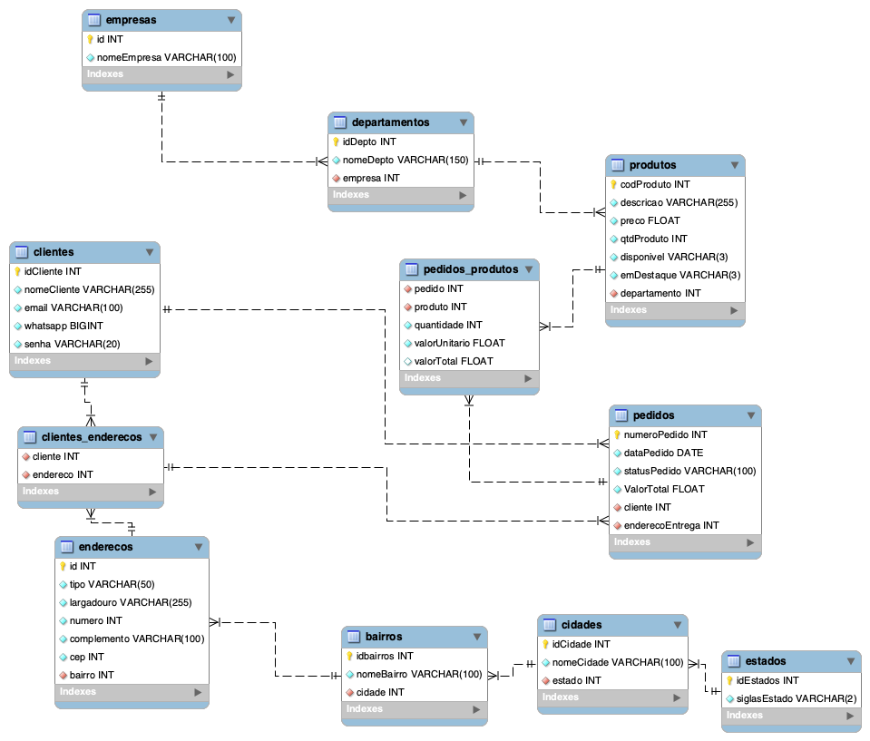

# Atividade 3 - Banco de dados

Todo o contexto da atividade pode ser encontrada [aqui](./contexto.md).

<br>

### Como utilizar!

  * clone esse repositório.

Passos:
</br>

  1. importar as tabelas ao mysql, usando o arquivo ([criacaotabelas.sql](./criacaotabelas.sql))
  2. importar todas as inserções das tabelas, usando o arquivo ([insercoes.sql](./insercoes.sql))
  3. realizar as consultas, todas estão em um único arquivo ([consultas.sql](./consultas.sql))
---
  ## Modelo
  

  Versão [PDF](./modeloer.pdf)
  Arquivo [Workbench](./gama.mwb)
  
---
  ## Consultas:

  #### no terminal para dar tudo certo, necessário fazer o seguinte antes de inserir as consultas: 
  > USE `gama`;

  >SET lc_time_names = "pt_br" ;

  <br>

  #### OBS: Todas as consultas são compostas por 1 situação problema, a consulta e o resultado emitido pelo terminal.

  <br>

* 1 consulta contemplando contagem ou totalização
  <br>
    
    **situação-problema**: Quero poder saber a quantidade total de produtos em estoque.
    <br>
    
    Código da consulta: 
    > SELECT SUM(qtdProduto) AS "Quantidade de produtos em estoque" FROM produtos;
  
    Retorno:

    ```console
    +-----------------------------------+
    | Quantidade de produtos em estoque |
    +-----------------------------------+
    |                              2568 |
    +-----------------------------------+
    1 row in set (0,20 sec)
    `````

* 1 consulta contemplando a junção entre 2 tabelas
  <br>
    
    **situação-problema**: Quero poder visualizar todos os produtos com quantidade em estoque maior que 10 e seu departamento.
    <br>
    
    Código da consulta: 
    > SELECT p.codProduto AS COD, p.descricao AS NOME, p.preco AS PRECO, p.qtdProduto AS QUANT, d.nomeDepto AS 'NOME DPTO' FROM produtos AS p INNER JOIN departamentos AS d ON p.departamento = d.idDepto WHERE p.qtdProduto > 10;
  
    Retorno:

    ```console
    +-------+-------------------------------------------------------------------------------------+-------+-------+---------------------+
    | COD   | NOME                                                                                | PRECO | QUANT | NOME DPTO           |
    +-------+-------------------------------------------------------------------------------------+-------+-------+---------------------+
    |  6530 | ADAPTADOR VGA MACHO / RJ45                                                          |     6 |   413 | Adaptadores         |
    |  7186 | ADAPTADOR GRAVADOR CADDY NB 9.5MM / HD 2.5 SATA                                     |   9.5 |    21 | Adaptadores         |
    |  7559 | ADAPTADOR HDMI FEMEA / DVI MACHO                                                    |     4 |    21 | Adaptadores         |
    | 13896 | ADAPTADOR EXTENDER / RJ45 BEGE                                                      |     1 |   101 | Adaptadores         |
    | 15464 | ADAPTADOR HDMI/VGA/AUDIO PRETO                                                      |   9.5 |    91 | Adaptadores         |
    | 16991 | ADAPTADOR EXTENDER HDMI / RJ45 60M                                                  |    39 |   120 | Adaptadores         |
    | 20212 | ADAPTADOR CONECTOR HDMI FEMEA L / FEMEA                                             |   2.8 |    20 | Adaptadores         |
    | 21299 | ADAPTADOR HDMI MACHO / DVI FEMEA                                                    |   6.5 |    81 | Adaptadores         |
    | 11719 | ALICATE PARA CRIMPAR TL-315 3 EM 1                                                  |    15 |    16 | Ferramentas         |
    |  5025 | CAMERA WEBCAM MICROSOFT LIFE CAM CINEMA HD 720p H5D-00013 -PROMOCAO                 |  46.5 |    76 | Eletronicos         |
    | 12263 | CAMERA WEBCAM LOGITECH C270 HD 960-000694                                           |    41 |    27 | Eletronicos         |
    | 23450 | CALCULADORA HP GRAFICA PRIME G2 PRETO/CINZA                                         |   132 |    23 | Eletronicos         |
    | 26941 | CAPTURA DE VIDEO ELGATO THUNDERBOLT3 DOCK 4K 10DAA4101 TYPE-C/DP/LAN/USB3.1/SOM     |   263 |    84 | Eletronicos         |
    |  1298 | FILTRO DE LINHA FORZA PS-001B  6 TOMADAS                                            |   3.9 |    22 | Acessorios          |
    |  1705 | CABO VGA / VGA   1.5MTS                                                             |   2.9 |    54 | Acessorios          |
    |  2717 | ESTABILIZADOR MICROFINS- 1500 BIVOLT P/02 MAQUINA                                   |  24.5 |    24 | Acessorios          |
    |  5544 | ESTABILIZADOR MICROFINS- 2000 BIVOLT P/02 MAQUINA                                   |    29 |    82 | Acessorios          |
    | 13168 | MONIT. LCD  4 EVERSUN WD-2030 USB                                                   |    49 |    63 | Acessorios          |
    | 15452 | MESA DIG. WACOM INTUOS PEN AND TOUCH SMALL CTL-4100/K0-AA PRETO                     |  82.5 |    61 | Acessorios          |
    | 18711 | CARREGADOR DE BATERIA TP-LINK PB10000 POWER BANK 02-SAIDAS USB                      |  11.7 |    33 | Acessorios          |
    | 20091 | GABINETE GAME THERMALTAKE V200 TG CA-3K8-50M1WU-00 PRETO - FONTE 500W - MID TOWER   |    81 |    54 | Acessorios          |
    | 25759 | TECLADO + MOUSE + MOUSEPAD + FONE GAME HAVIT KB501CM GAMENOTE ESPANHOL PRETO        |    25 |    23 | Acessorios          |
    | 25967 | CARREGADOR DE BATERIA XIAOMI VXN4305GL 10000MAH 02-SAIDAS USB PRETO S/GARANTIA      | 10.45 |    83 | Acessorios          |
    | 26471 | CARREGADOR DE BATERIA P/CARRO XIAOMI MI 37W CC06ZM 2-SAIDAS USB PRETO S/GARANTIA    |  8.85 |    64 | Acessorios          |
    | 26777 | MESA DIG. HUION H420 INSPIROY PEN GRAPHICS PRETO                                    |  49.9 |    11 | Acessorios          |
    | 27085 | CABO UTP CAT6 LANPRO LP-4C6USYL3 3MTS AMARELO                                       |     4 |    23 | Acessorios          |
    | 27787 | MICROFONE ELGATO WAVE1 10MAA9901 DIGITAL PRETO                                      |   149 |    41 | Acessorios          |
    | 20438 | CADEIRA GAMER MTEK MK02 PRETO/VERMELHO                                              |   190 |    78 | Moveis              |
    | 22125 | MESA GAMER MTEK GM01 LED RGB PRETO                                                  |   170 |    66 | Moveis              |
    | 24672 | CEL SAMSUNG A31 A315G 4GB/128GB AZUL DUAL SIM LTE 6.4                               | 204.5 |    16 | Tablets e Celulares |
    | 27131 | TABLET AMAZON FIRE  HD8 KIDS EDITION 2GB/32GB AZUL WIFI/QUAD CORE 8                 |    99 |    34 | Tablets e Celulares |
    | 27133 | TABLET AMAZON FIRE  HD8 KIDS EDITION 2GB/32GB ROSA WIFI/QUAD CORE 8                 |    99 |    18 | Tablets e Celulares |
    | 19757 | GAME CONTROLE REDRAGON HARROW G808 VIBRATION PC/PS3                                 |  21.5 |    72 | Games               |
    | 25175 | CONSOLE SUPER MINI CLASSIC SN-02 CINZA C/821 JOGOS                                  |  28.5 |    28 | Games               |
    | 26335 | CONSOLE SONY PS4 SLIM 1TB CUH-2215B PRETO BIVOLT                                    |   382 |    45 | Games               |
    | 27541 | CONSOLE SONY PS4 SLIM 1TB CUH-2215B PRETO BIVOLT + JOGO FIFA21 EA SPORT             |   418 |    75 | Games               |
    | 25963 | IMPRESSORA  XIAOMI FOTOGRAFICA MI PORTABLE PHOTO PRINTER TEJ4018GL BLUETOOTH BRANCO |  48.9 |    62 | Informatica         |
    | 26322 | MOUSE GAME COOLER MASTER MM110 RGB PRETO MM-110-GKOM1                               |    17 |    64 | Informatica         |
    | 26658 | PENDRIVE   8GB ADATA AC906-8GB USB 2.0  PRETO                                       |  2.85 |    28 | Informatica         |
    | 27642 | MONIT. LED 15.6 HYE HY16WLNC HD/VGA/HDMI PRETO                                      |    68 |    12 | Informatica         |
    | 27707 | FONE C/ MICROFONE JBL C50HI PRETO                                                   |     7 |    29 | Informatica         |
    +-------+-------------------------------------------------------------------------------------+-------+-------    +---------------------+
    41 rows in set (0,01 sec)
    ``````

* 1 consulta contemplando a junção entre 3 tabelas
  <br>
    
    **situação-problema**: Quero poder saber todos os pedidos já realizados junto de: sua data, status, nome do cliente e CEP de entrega.
    <br>
    
    Código da consulta: 
    > SELECT pedidos.numeroPedido AS PEDIDO, DATE_FORMAT(pedidos.dataPedido,"%e, %M de %Y") AS DATA, pedidos.statusPedido AS STATUS, clientes.nomeCliente AS CLIENTE, CONCAT(SUBSTRING(e.cep,1,2),'.',SUBSTRING(e.cep,3,3),'-',SUBSTRING(e.cep,6,3)) AS "CEP da entrega" from pedidos INNER JOIN clientes ON pedidos.cliente = clientes.idCliente INNER JOIN enderecos AS e ON e.id = pedidos.enderecoEntrega;

  
    Retorno:

    ```console
    +--------+----------------------+----------------------+--------------------+----------------+
    | PEDIDO | DATA                 | STATUS               | CLIENTE            | CEP da entrega |
    +--------+----------------------+----------------------+--------------------+----------------+
    |   1025 | 12, maio de 2021     | Aguardando Pagamento | Antonio C da Silva | 81.770-777     |
    |   6254 | 15, maio de 2021     | Pagamento autorizado | Felipe José        | 13.273-269     |
    |   6528 | 1, fevereiro de 2021 | Entregue             | João da Silva      | 13.273-358     |
    |   6589 | 14, agosto de 2020   | Entregue             | José da Silva      | 13.273-269     |
    |   7896 | 1, março de 2021     | Novo pedido          | Maria da Silva     | 81.770-777     |
    |   8963 | 5, janeiro de 2020   | Pagamento negado     | Safira Mendes      | 13.273-358     |
    |   9624 | 15, maio de 2021     | Aguardando pagamento | Felipe José        | 81.070-001     |
    |   9632 | 10, maio de 2021     | Em Separação         | Antonio C da Silva | 81.770-777     |
    |   9658 | 20, dezembro de 2020 | Cancelado            | José da Silva      | 13.273-269     |
    |   9984 | 1, fevereiro de 2021 | Entregue             | Francisco Sousa    | 81.070-001     |
    +--------+----------------------+----------------------+--------------------+----------------+
    10 rows in set (0,00 sec)
    `````
* 1 consulta contemplando a junção entre 2 tabelas + uma operação de totalização e agrupamento
  <br>
    
    **situação-problema**: Quero poder saber qual valor total gasto pelo cliente em minha loja.
    <br>
    
    Código da consulta: 
    > SELECT cliente AS ID, clientes.nomeCliente AS NOME, CONCAT('$ ',FORMAT(sum(valorTotal),2)) AS "Total em compras"   FROM pedidos INNER JOIN clientes ON pedidos.cliente = clientes.idCliente GROUP BY cliente;
  
    Retorno:

    ```console
    +----+--------------------+------------------+
    | ID | NOME               | Total em compras |
    +----+--------------------+------------------+
    |  8 | Antonio C da Silva | $ 4,370.00       |
    |  1 | Felipe José        | $ 1,372.20       |
    |  4 | João da Silva      | $ 70.50          |
    |  2 | José da Silva      | $ 1,585.00       |
    |  5 | Maria da Silva     | $ 603.00         |
    |  6 | Safira Mendes      | $ 149.00         |
    |  3 | Francisco Sousa    | $ 25.00          |
    +----+--------------------+------------------+
    7 rows in set (0,16 sec)
    `````
* 1 consulta contemplando a junção entre 3 ou mais tabelas + uma operação de totalização e agrupamento
  <br>
    
    **situação-problema**: Quero poder consultar em um unico retorno, o nome da empresa, os departamentos, a quantidade de produtos ja vendidos por cada um junto do produto de maior valor ja vendido e seu preço.
    <br>
    
    Código da consulta: 
    > SELECT empresas.nomeEmpresa AS "Nome da empresa", departamento AS "Cod Depto", d.nomeDepto AS Departamento, sum(pp.quantidade) AS "Qtd Prod Vendidos", ANY_VALUE(descricao) AS "Produto mais caro vendido do departamento", CONCAT('$ ',FORMAT(MAX(preco),2)) AS "Valor"  from produtos INNER JOIN departamentos AS d ON departamento = d.idDepto INNER JOIN pedidos_produtos AS pp ON produtos.codProduto = pp.produto INNER JOIN empresas ON empresas.id = d.empresa  GROUP BY departamento;

  
    Retorno:

    ```console
    +-----------------+-----------+---------------------+-------------------+---------------------------------------------------------------------------------------+----------+
    | Nome da empresa | Cod Depto | Departamento        | Qtd Prod Vendidos | Produto mais caro vendido do departamento                                             | Valor    |
    +-----------------+-----------+---------------------+-------------------+---------------------------------------------------------------------------------------+----------+
    | GAMA ACADEMY    |         1 | Adaptadores         |                 6 | ADAPTADOR CONVERSOR HDMI / RCA FULLHD 1080 BRANCO                                     | $ 14.00  |
    | GAMA ACADEMY    |         2 | Ferramentas         |                 1 | CADEADO SEGURANCA PARA NOTEBOOK HLD Fu0026K LLAVE                                     | $ 6.50   |
    | GAMA ACADEMY    |         3 | Eletronicos         |                 2 | CAMERA GOPRO HERO 8 CHDHX-801-RW PRETO                                                | $ 340.00 |
    | GAMA ACADEMY    |         5 | Acessorios          |                 1 | MICROFONE ELGATO WAVE1 10MAA9901 DIGITAL PRETO                                        | $ 149.00 |
    | GAMA ACADEMY    |         6 | Moveis              |                 1 | CADEIRA GAMER MTEK MK02 PRETO/VERMELHO                                                | $ 190.00 |
    | GAMA ACADEMY    |         7 | Tablets e Celulares |                 3 | TABLET AMAZON FIRE 7 1GB/16GB PRETO WIFI/QUAD CORE 7                                  | $ 204.50 |
    | GAMA ACADEMY    |         8 | Games               |                17 | GAME CONTROLE REDRAGON HARROW G808 VIBRATION PC/PS3                                   | $ 418.00 |
    | GAMA ACADEMY    |         9 | Informatica         |                23 | DESKTOP ACER C24-963-UA91 I3-1005G1 1.2GHz/8GB/512GB SSD/23.8FHD IPS/W10/INGLES PRETO | $ 750.00 |
    +-----------------+-----------+---------------------+-------------------+---------------------------------------------------------------------------------------+----------+
    8 rows in set, 1 warning (0,15 sec)
    `````
* BONUS: 1 consulta contemplando a junção entre 2 tabelas + uma operação
  <br>
    
    **situação-problema**: Quero saber o valor do inventário de cada departamento.
    <br>
    
    Código da consulta: 
    > SELECT departamento AS id, departamentos.nomeDepto AS Departamento, CONCAT('$ ',FORMAT(SUM(preco * qtdProduto),1)) AS "Inventário" FROM produtos INNER JOIN departamentos ON produtos.departamento = departamentos.idDepto GROUP BY departamento;

  
    Retorno:

    ```console
    +----+---------------------+-------------+
    | id | Departamento        | Inventário  |
    +----+---------------------+-------------+
    |  1 | Adaptadores         | $ 9,443.9   |
    |  2 | Ferramentas         | $ 253.0     |
    |  3 | Eletronicos         | $ 32,043.0  |
    |  4 | Casa                | $ 769.8     |
    |  5 | Acessorios          | $ 27,628.3  |
    |  6 | Moveis              | $ 33,085.0  |
    |  7 | Tablets e Celulares | $ 8,870.0   |
    |  8 | Games               | $ 55,908.0  |
    |  9 | Informatica         | $ 5,218.6   |
    +----+---------------------+-------------+
    9 rows in set, 1 warning (0,00 sec)
    `````
* BONUS: 1 consulta contemplando a junção entre 3 tabelas
  <br>
  
  **situação-problema**: Quero poder saber quais são meus clientes cadastrados e listar além de email e whatsapp todos os seus respectivos endereços (somente CEP).
  <br>
  Código da consulta: 
  > SELECT c.idCliente AS ID, c.nomeCliente AS "NOME CLIENTE", c.email AS "E-MAIL", CONCAT(SUBSTRING(c.whatsapp,1,2),' ',SUBSTRING(c.whatsapp,4,4),'-',SUBSTRING(c.whatsapp,8,4)) AS WHATSAPP, CONCAT(SUBSTRING(e.cep,1,2),'.',SUBSTRING(e.cep,3,3),'-',SUBSTRING(e.cep,6,3)) AS CEP FROM clientes_enderecos AS ce INNER JOIN clientes AS c ON c.idCliente = ce.cliente INNER JOIN  enderecos AS e ON e.id = ce.endereco;

  Retorno: 
  ```console
  +----+--------------------+---------------------+--------------+------------+
  | ID | NOME CLIENTE       | E-MAIL              | WHATSAPP     | CEP        |
  +----+--------------------+---------------------+--------------+------------+
  |  1 | Felipe José        | felipe@gmail.com    | 41 9247-6077 | 81.070-001 |
  |  1 | Felipe José        | felipe@gmail.com    | 41 9247-6077 | 13.273-269 |
  |  2 | José da Silva      | jose@gmail.com      | 41 9999-9999 | 13.273-269 |
  |  3 | Francisco Sousa    | francisco@gmail.com | 41 9999-9999 | 81.070-001 |
  |  4 | João da Silva      | joao@gmail.com      | 11 9999-9999 | 13.273-358 |
  |  4 | João da Silva      | joao@gmail.com      | 11 9999-9999 | 13.273-358 |
  |  5 | Maria da Silva     | maria@gmail.com     | 11 9999-9999 | 81.770-777 |
  |  5 | Maria da Silva     | maria@gmail.com     | 11 9999-9999 | 13.273-358 |
  |  6 | Safira Mendes      | safira@gmail.com    | 11 9999-9999 | 13.273-358 |
  |  7 | Catarina Bond      | catarina@gmail.com  | 11 9999-9999 | 13.273-358 |
  |  8 | Antonio C da Silva | antonio@gmail.com   | 11 9999-9999 | 81.770-777 |
  |  8 | Antonio C da Silva | antonio@gmail.com   | 11 9999-9999 | 81.770-777 |
  +----+--------------------+---------------------+-------------- +------------+
  12 rows in set (0,04 sec)
  `````
